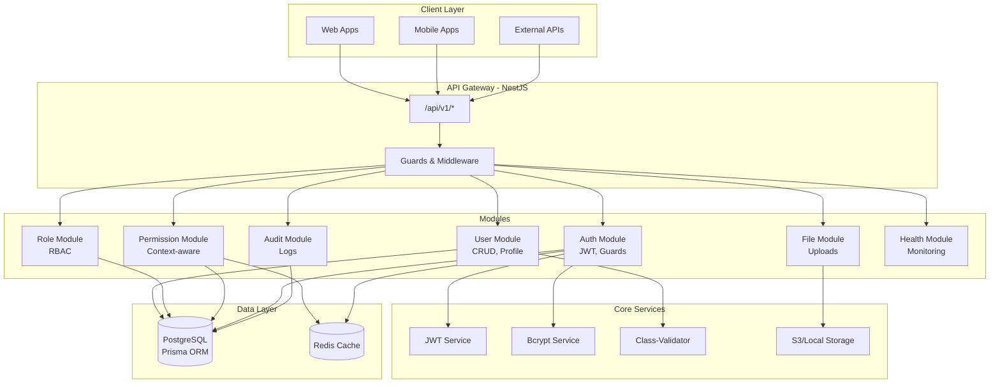
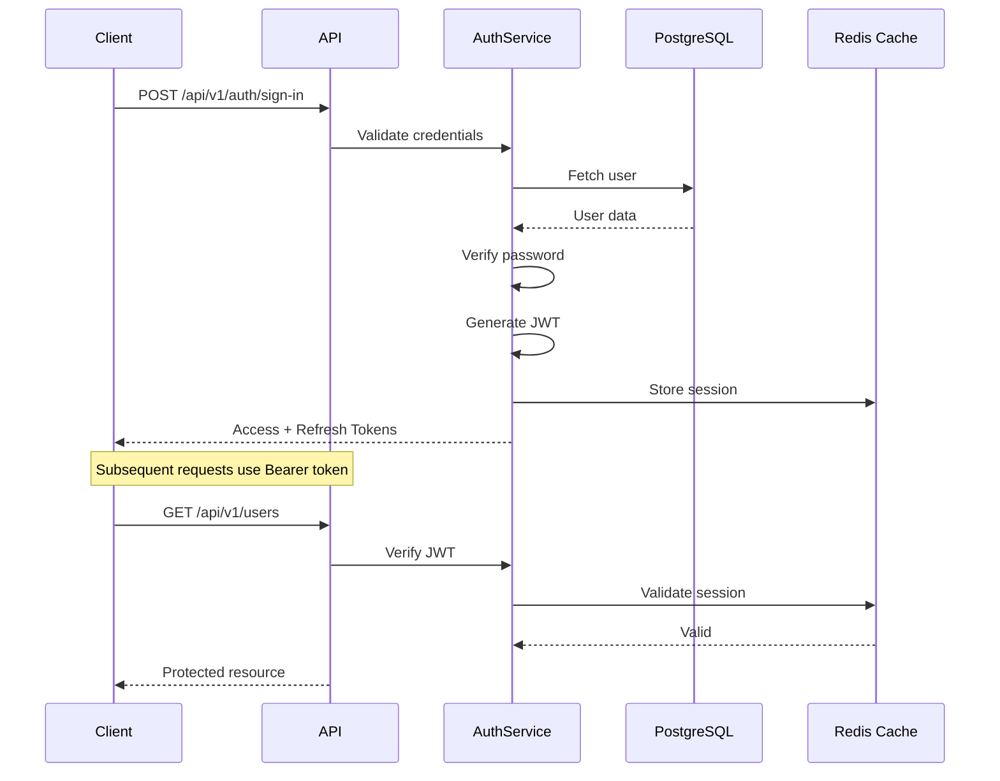

<h1 align="center">
  
</h1>

<p align="center">
  
  
  
  
  
</p>

<br>

<p align="center">
  <a href="README.md">English</a>
</p>

<p align="center">
  <a href="#bookmark-about">About</a>&nbsp;&nbsp;|&nbsp;&nbsp;
  <a href="#computer-technologies">Technologies</a>&nbsp;&nbsp;|&nbsp;&nbsp;
  <a href="#wrench-tools">Tools</a>&nbsp;&nbsp;|&nbsp;&nbsp;
  <a href="#package-installation">Installation</a>&nbsp;&nbsp;|&nbsp;&nbsp;
  <a href="#memo-license">License</a>
</p>

<br>

## :bookmark: About

**Nest ACL** is a **modular Access Control List API** built with **NestJS**, **PostgreSQL**, and **Prisma ORM**.  
It provides a robust foundation for **authentication**, **authorization**, and **role-based access control (RBAC)**.  
Following **clean architecture principles**, it ensures clear separation of concerns and serves as a reusable base for multiple projects.

---

### 🏗️ Architecture Overview



### 🔐 Authentication Flow




### 📁 Folder Structure

```bash
src/
├── auth/           # Auth module (JWT, Guards)
├── users/          # User module (CRUD, profile)
├── roles/          # Role module (RBAC logic)
├── permissions/    # Permission module (context-aware)
├── audit/          # Audit logs
├── common/         # Shared utilities, interceptors, pipes
└── main.ts         # Bootstrap file

```


### 🌟 Key Features

    - 🔐 JWT Authentication with refresh tokens
    - 👥 Role-Based Access Control (RBAC)
    - 🎯 Context-aware permissions (own, any, team, department)
    - 🗄️ PostgreSQL database managed with Prisma ORM
    - 🧩 Modular architecture for scalability
    - 🚀 RESTful API following clean standards
    - 📤 File Upload Support (local/S3)
    - 🏥 Health Checks and monitoring
    - 📝 Validation with DTOs and class-validator
    - ⚡ Redis caching for permissions and sessions
    - 🕵 Audit Logs to track access and permission checks

### :computer: Technologies

    - NestJS
        – Node.js framework 
    - TypeScript 
    - PostgreSQL
        – Relational database 
    - Prisma ORM
        – Type-safe database access 
    - Redis
        – Session & permission caching 
    - Docker
        – Containerized environment


### :wrench: Tools

    - VS Code or WebStorm 
    - Insomnia – API testing 
    - PgAdmin – Database management